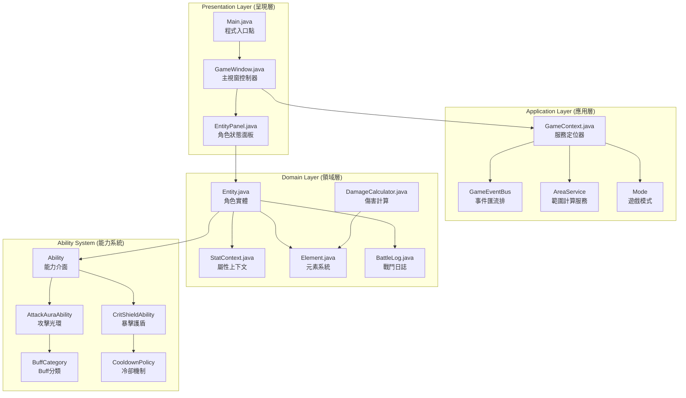
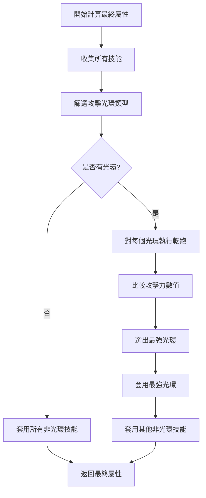
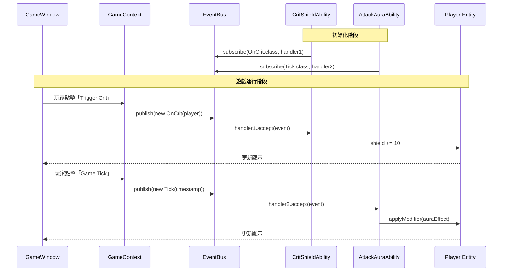
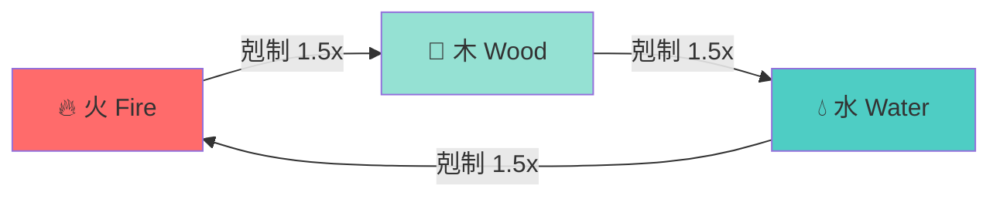
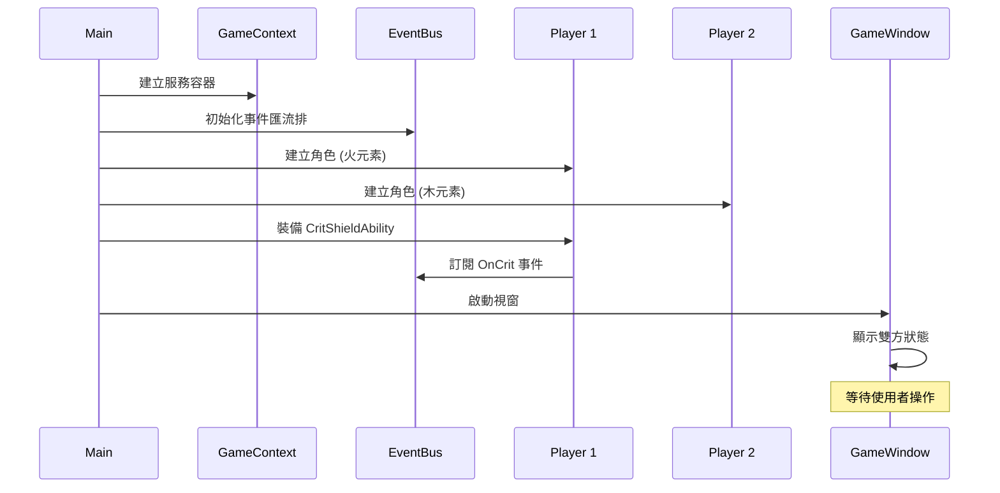
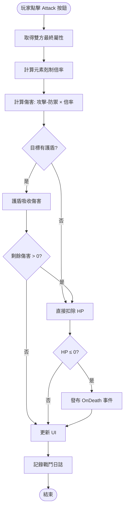

# RuneRise 遊戲能力系統 - 程式詳細說明文件

## 📋 文件摘要

### 專案資訊
- **專案名稱**：RuneRise 遊戲能力系統 (Game Ability System)
- **開發語言**：Java (JDK 8+)
- **架構模式**：事件驅動架構 (Event-Driven Architecture) + 組合模式 (Composition Pattern)
- **圖形介面**：Java Swing
- **文件版本**：v2.0
- **最後更新**：2026 年 1 月 3 日

### 專案概述
本專案實作一個完整的 ARPG（動作角色扮演遊戲）戰鬥系統，展示如何使用物件導向設計原則構建可擴展、易維護的遊戲機制。系統核心包含：
1. **元素剋制系統**：實現火、水、木三元素間的相剋關係
2. **動態能力系統**：支援技能的動態掛載與移除
3. **事件驅動機制**：透過事件匯流排實現鬆耦合的組件通訊
4. **圖形化介面**：提供直觀的遊戲狀態展示與操作介面
5. **雙模式支援**：PVE/PVP 模式下的平衡機制

### 技術亮點
- ✅ **設計模式應用**：觀察者模式、策略模式、服務定位器模式
- ✅ **物件導向原則**：高內聚低耦合、開放封閉原則
- ✅ **進階機制**：Buff 互斥、冷卻時間管理、動態屬性計算
- ✅ **完整 GUI**：即時戰鬥日誌、角色狀態面板、互動操作

---

## 🏗️ 系統架構設計

### 整體架構圖


### 三層架構說明

#### 1. 呈現層 (Presentation Layer)
負責使用者介面與互動邏輯：
- **Main.java**：應用程式入口點，負責初始化系統元件、建立測試角色並啟動 GUI
- **GameWindow.java**：主視窗控制器，管理戰鬥操作按鈕、模式切換與戰鬥日誌顯示
- **EntityPanel.java**：角色資訊面板，動態顯示角色的 HP、護盾、元素屬性與 Buff 狀態

#### 2. 應用層 (Application Layer)
提供系統級服務與協調功能：
- **GameContext**：服務定位器模式的實現，作為全域存取點提供事件匯流排、區域服務與遊戲模式
- **GameEventBus**：事件驅動架構的核心，實現觀察者模式，管理事件的發布與訂閱
- **AreaService**：計算範圍效果（如光環）影響的角色，支援團隊協作機制
- **Mode**：遊戲模式列舉（PVE/PVP），影響技能效果與平衡機制

#### 3. 領域層 (Domain Layer)
封裝核心業務邏輯：
- **Entity**：角色實體，管理生命值、護盾、元素屬性、技能清單與屬性修正器
- **StatContext**：屬性上下文，封裝攻擊、防禦、暴擊等數值
- **Element**：元素系統，定義火、水、木三元素與相剋關係
- **DamageCalculator**：傷害計算引擎，整合元素剋制與屬性運算
- **BattleLog**：戰鬥日誌系統，記錄遊戲事件用於除錯與回放

---

## 📦 核心類別詳細說明

### 1. Entity（角色實體）

#### 類別職責
`Entity` 類別是遊戲中角色的核心表示，封裝了角色的所有狀態與行為，包括生命值管理、屬性計算、技能系統與傷害處理。

#### 完整類別定義
```java
public class Entity {
    // === 基本屬性 ===
    public String name;                          // 角色名稱
    public int shield;                           // 護盾值（優先吸收傷害）
    public int maxHp;                            // 最大生命值
    public int currentHp;                        // 當前生命值
    public Element element;                      // 元素屬性（火/水/木）
    
    // === 狀態與技能 ===
    public List<String> buffs = new ArrayList<>();           // Buff 顯示清單
    public List<Ability> abilities = new ArrayList<>();      // 已裝備技能清單
    public BattleLog log;                        // 戰鬥日誌
    private StatContext baseStats;               // 基礎屬性（未修正）
    
    // === 建構子 ===
    public Entity(String name, int maxHp, Element element, StatContext baseStats) {
        this.name = name;
        this.maxHp = maxHp;
        this.currentHp = maxHp;
        this.element = element;
        this.baseStats = baseStats;
        this.log = new BattleLog();
    }
    
    // === 技能管理 ===
    public void addAbility(Ability ability, GameContext ctx) {
        abilities.add(ability);
        ability.onAttach(this, ctx);
        log.add(name + " 獲得技能: " + ability.id());
    }
    
    public void removeAbility(String id, GameContext ctx) {
        abilities.removeIf(a -> {
            if (a.id().equals(id)) {
                a.onDetach(this, ctx);
                return true;
            }
            return false;
        });
        log.add(name + " 移除技能: " + id);
    }
    
    // === 屬性修正器 ===
    public void applyModifier(MyModifier mod) {
        buffs.add(mod.name);
        abilities.add(mod);
        log.add(name + " 獲得增益: " + mod.name);
    }
    
    // === 傷害處理 ===
    public void takeDamage(int amount) {
        int remaining = amount;
        
        // 階段一：護盾吸收傷害
        if (shield > 0) {
            int absorbed = Math.min(shield, remaining);
            shield -= absorbed;
            remaining -= absorbed;
            log.add(String.format("%s 的護盾吸收 %d 傷害（剩餘護盾：%d）", 
                                 name, absorbed, shield));
        }
        
        // 階段二：扣除生命值
        if (remaining > 0) {
            currentHp = Math.max(0, currentHp - remaining);
            log.add(String.format("%s 受到 %d 傷害（剩餘HP：%d/%d）", 
                                 name, remaining, currentHp, maxHp));
        }
    }
    
    // === 最終屬性計算（含互斥機制）===
    public StatContext getFinalStats() {
        StatContext result = baseStats;
        
        // 收集所有攻擊光環
        List<Ability> auraAbilities = new ArrayList<>();
        for (Ability a : abilities) {
            if (a.category() == BuffCategory.ATTACK_AURA) {
                auraAbilities.add(a);
            }
        }
        
        // 互斥處理：只套用最強光環
        Ability bestAura = null;
        if (!auraAbilities.isEmpty()) {
            int maxAttack = 0;
            for (Ability aura : auraAbilities) {
                int dryRunAttack = aura.modify(result).attack;
                if (dryRunAttack > maxAttack) {
                    maxAttack = dryRunAttack;
                    bestAura = aura;
                }
            }
        }
        
        // 套用所有非攻擊光環 + 最強攻擊光環
        for (Ability a : abilities) {
            if (a.category() != BuffCategory.ATTACK_AURA) {
                result = a.modify(result);
            } else if (a == bestAura) {
                result = a.modify(result);
            }
        }
        
        return result;
    }
}
```

#### 關鍵設計說明

##### 1. 護盾機制
護盾系統實現了**優先吸收傷害**的機制：
- 傷害優先扣除 `shield` 值
- 護盾不足時，剩餘傷害才扣除 `currentHp`
- 護盾歸零後不影響技能的正常運作（如 CritShieldAbility 可重新充能）

##### 2. 屬性計算流程
```
基礎屬性 (baseStats)
    ↓
收集所有技能 (abilities)
    ↓
識別攻擊光環 (category == ATTACK_AURA)
    ↓
乾跑 (Dry-Run) 比較光環效果
    ↓
選出最強光環 (maxAttack)
    ↓
套用：非光環技能 + 最強光環
    ↓
最終屬性 (finalStats)
```

##### 3. 技能生命週期
- **裝備時**：`addAbility()` → `ability.onAttach()`
- **移除時**：`removeAbility()` → `ability.onDetach()`
- **計算時**：`getFinalStats()` → `ability.modify()`

---

### 2. GameEventBus（事件匯流排）

#### 設計模式：觀察者模式 (Observer Pattern)

#### 介面定義
```java
public interface GameEventBus {
    // 發布事件到所有訂閱者
    void publish(Object event);
    
    // 訂閱特定類型的事件
    <T> void subscribe(Class<T> eventType, Consumer<T> handler);
}
```

#### 實作類別
```java
public class SimpleEventBus implements GameEventBus {
    // 儲存結構：事件類型 → 處理器清單
    private Map<Class<?>, List<Consumer<?>>> listeners = new HashMap<>();
    
    @Override
    public void publish(Object event) {
        Class<?> eventClass = event.getClass();
        List<Consumer<?>> handlers = listeners.get(eventClass);
        
        if (handlers != null) {
            // 同步呼叫所有處理器
            for (Consumer<?> handler : handlers) {
                ((Consumer<Object>) handler).accept(event);
            }
        }
    }
    
    @Override
    public <T> void subscribe(Class<T> eventType, Consumer<T> handler) {
        listeners.computeIfAbsent(eventType, k -> new ArrayList<>()).add(handler);
    }
}
```

#### 優勢分析
1. **鬆耦合**：事件發布者不需知道訂閱者的存在
2. **可擴展**：新增事件類型不需修改現有程式碼
3. **型別安全**：使用泛型確保型別正確性
4. **簡潔性**：使用 Lambda 表達式簡化訂閱語法

#### 實際應用範例
```java
// 定義事件類別
class OnCrit { 
    Entity caster; 
}

class Tick { 
    long timestamp; 
}

// 訂閱事件
eventBus.subscribe(OnCrit.class, event -> {
    System.out.println(event.caster.name + " 觸發暴擊！");
    event.caster.shield += 10;
});

// 發布事件
eventBus.publish(new OnCrit(player1));
```

---

### 3. Ability（技能介面）

#### 介面設計
```java
public interface Ability {
    // 技能唯一識別碼
    String id();
    
    // 技能分類（用於互斥判斷）
    BuffCategory category();
    
    // 技能裝備時的初始化邏輯
    void onAttach(Entity self, GameContext ctx);
    
    // 技能移除時的清理邏輯
    void onDetach(Entity self, GameContext ctx);
    
    // 屬性修正函數（純函數）
    StatContext modify(StatContext stats);
}
```

#### BuffCategory 列舉
```java
public enum BuffCategory {
    ATTACK_AURA,      // 攻擊光環（觸發互斥機制）
    CRIT_SHIELD,      // 暴擊護盾
    PASSIVE,          // 被動技能
    ACTIVE            // 主動技能
}
```

---

### 4. CritShieldAbility（暴擊護盾技能）

#### 技能設計說明
當角色觸發暴擊時，自動為自己增加護盾，並具備冷卻時間限制。

#### 完整實作
```java
public class CritShieldAbility implements Ability {
    private final int shieldAmount;
    private final CooldownPolicy cooldown;
    
    public CritShieldAbility(int shieldAmount, long cooldownMs) {
        this.shieldAmount = shieldAmount;
        this.cooldown = new CooldownPolicy(cooldownMs);
    }
    
    @Override
    public String id() {
        return "CritShield";
    }
    
    @Override
    public BuffCategory category() {
        return BuffCategory.CRIT_SHIELD;
    }
    
    @Override
    public void onAttach(Entity self, GameContext ctx) {
        // 訂閱暴擊事件
        ctx.eventBus.subscribe(Events.OnCrit.class, event -> {
            if (event.caster == self) {
                if (cooldown.ready(self)) {
                    self.shield += shieldAmount;
                    self.log.add(String.format("%s 觸發【暴擊護盾】+%d 護盾", 
                                              self.name, shieldAmount));
                    cooldown.use(self);
                } else {
                    self.log.add(String.format("%s 的【暴擊護盾】冷卻中", self.name));
                }
            }
        });
    }
    
    @Override
    public void onDetach(Entity self, GameContext ctx) {
        // 注意：當前實作未處理取消訂閱
        // 未來可擴充 EventBus.unsubscribe() 功能
    }
    
    @Override
    public StatContext modify(StatContext stats) {
        return stats;  // 不修改屬性
    }
}
```

#### 冷卻機制實作
```java
public class CooldownPolicy {
    private final long cooldownMs;
    private Map<Entity, Long> lastUseTimes = new HashMap<>();
    
    public CooldownPolicy(long cooldownMs) {
        this.cooldownMs = cooldownMs;
    }
    
    public boolean ready(Entity e) {
        Long lastTime = lastUseTimes.get(e);
        if (lastTime == null) return true;
        return System.currentTimeMillis() - lastTime >= cooldownMs;
    }
    
    public void use(Entity e) {
        lastUseTimes.put(e, System.currentTimeMillis());
    }
}
```

---

### 5. AttackAuraAbility（攻擊光環技能）

#### 技能設計說明
定期為範圍內的盟友提供攻擊加成，支援 PVP 模式下的效果限制（上限 5%）。

#### 完整實作
```java
public class AttackAuraAbility implements Ability {
    private final double multiplier;
    
    public AttackAuraAbility(double multiplier) {
        this.multiplier = multiplier;
    }
    
    @Override
    public String id() {
        return "AttackAura";
    }
    
    @Override
    public BuffCategory category() {
        return BuffCategory.ATTACK_AURA;
    }
    
    @Override
    public void onAttach(Entity self, GameContext ctx) {
        // 訂閱 Tick 事件，定期刷新光環
        ctx.eventBus.subscribe(Events.Tick.class, event -> {
            List<Entity> allies = ctx.areaService.getAlliesInRange(self, 10.0);
            for (Entity ally : allies) {
                if (ally != self) {
                    ally.applyModifier(new AuraEffectModifier(self, ctx));
                }
            }
        });
    }
    
    @Override
    public void onDetach(Entity self, GameContext ctx) {
        // 移除光環效果（未來可擴充）
    }
    
    @Override
    public StatContext modify(StatContext stats) {
        return stats;  // 光環本身不修改持有者屬性
    }
    
    // === 內部類別：光環效果修正器 ===
    private class AuraEffectModifier implements Ability {
        private final Entity source;
        private final GameContext ctx;
        
        AuraEffectModifier(Entity source, GameContext ctx) {
            this.source = source;
            this.ctx = ctx;
        }
        
        @Override
        public String id() {
            return "AuraEffect_" + source.name;
        }
        
        @Override
        public BuffCategory category() {
            return BuffCategory.ATTACK_AURA;
        }
        
        @Override
        public StatContext modify(StatContext stats) {
            double effectiveMultiplier = multiplier;
            
            // PVP 模式限制光環效果
            if (ctx.mode == Mode.PVP) {
                effectiveMultiplier = Math.min(effectiveMultiplier, 1.05);
            }
            
            return new StatContext(
                (int)(stats.attack * effectiveMultiplier),
                stats.defense,
                stats.crit
            );
        }
        
        @Override
        public void onAttach(Entity self, GameContext ctx) {}
        
        @Override
        public void onDetach(Entity self, GameContext ctx) {}
    }
}
```

#### 關鍵機制說明

##### PVP 平衡機制
```java
if (ctx.mode == Mode.PVP) {
    effectiveMultiplier = Math.min(effectiveMultiplier, 1.05);
}
```
在 PVP 模式下，所有光環效果上限為 5%（1.05 倍），防止光環堆疊導致遊戲失衡。

##### 範圍計算
```java
List<Entity> allies = ctx.areaService.getAlliesInRange(self, 10.0);
```
使用 `AreaService` 計算範圍內的盟友，支援未來擴充為真實座標系統。

---

## ⚙️ 關鍵機制深入解析

### 1. Buff 互斥機制 (Mutual Exclusion)

#### 機制目的
防止同類型 Buff 的效果堆疊導致數值失衡，確保遊戲平衡性。

#### 實作流程圖


#### 核心程式碼詳解
```java
public StatContext getFinalStats() {
    StatContext result = baseStats;
    
    // 步驟1：識別所有攻擊光環
    List<Ability> auraAbilities = new ArrayList<>();
    for (Ability a : abilities) {
        if (a.category() == BuffCategory.ATTACK_AURA) {
            auraAbilities.add(a);
        }
    }
    
    // 步驟2：乾跑比較（不實際修改屬性）
    Ability bestAura = null;
    if (!auraAbilities.isEmpty()) {
        int maxAttack = 0;
        for (Ability aura : auraAbilities) {
            // 暫時套用光環，取得攻擊力數值
            int dryRunAttack = aura.modify(result).attack;
            if (dryRunAttack > maxAttack) {
                maxAttack = dryRunAttack;
                bestAura = aura;
            }
        }
    }
    
    // 步驟3：正式套用（只套用最強光環）
    for (Ability a : abilities) {
        if (a.category() != BuffCategory.ATTACK_AURA) {
            result = a.modify(result);  // 套用非光環技能
        } else if (a == bestAura) {
            result = a.modify(result);  // 套用最強光環
        }
        // 其他光環被忽略
    }
    
    return result;
}
```

#### 實例說明
假設角色同時受到兩個光環效果：
- **光環 A**：攻擊力 × 1.20（+20%）
- **光環 B**：攻擊力 × 1.10（+10%）

**互斥機制運作**：
1. 基礎攻擊力：100
2. 乾跑 A：100 × 1.20 = 120
3. 乾跑 B：100 × 1.10 = 110
4. 選擇最強：光環 A（120 > 110）
5. 最終攻擊力：120（只套用光環 A）

**未使用互斥的結果**：
- 錯誤計算：100 × 1.20 × 1.10 = 132（過於強大）

---

### 2. PVP 平衡機制 (PVP Cap)

#### 設計理念
在玩家對戰 (PVP) 模式下，限制輔助技能的效果，避免因光環堆疊導致勝負由裝備決定而非技術。

#### 模式定義
```java
public enum Mode {
    PVE,  // 玩家 vs 環境（無限制）
    PVP   // 玩家 vs 玩家（效果限制）
}
```

#### 限制實作
```java
@Override
public StatContext modify(StatContext stats) {
    double effectiveMultiplier = this.multiplier;
    
    // 檢查遊戲模式
    if (ctx.mode == Mode.PVP) {
        // 強制上限為 1.05（5% 加成）
        effectiveMultiplier = Math.min(effectiveMultiplier, 1.05);
    }
    
    return new StatContext(
        (int)(stats.attack * effectiveMultiplier),
        stats.defense,
        stats.crit
    );
}
```

#### 效果對比表

| 原始光環倍率 | PVE 模式最終效果 | PVP 模式最終效果 | 限制說明 |
|------------|----------------|----------------|---------|
| 1.50 (50%) | 150%           | 105% ✂️       | 被限制 |
| 1.20 (20%) | 120%           | 105% ✂️       | 被限制 |
| 1.05 (5%)  | 105%           | 105%           | 未限制 |
| 1.03 (3%)  | 103%           | 103%           | 未限制 |

#### 實際應用場景
```java
// 場景：玩家開啟強力光環後進入 PVP 競技場
AttackAuraAbility strongAura = new AttackAuraAbility(1.50);  // 50% 加成
player.addAbility(strongAura, ctx);

// 切換模式前（PVE）
ctx.mode = Mode.PVE;
int attackPVE = player.getFinalStats().attack;  // 假設基礎 100 → 150

// 切換模式後（PVP）
ctx.mode = Mode.PVP;
int attackPVP = player.getFinalStats().attack;  // 自動降為 105

System.out.println("PVE 攻擊力: " + attackPVE);  // 輸出：150
System.out.println("PVP 攻擊力: " + attackPVP);  // 輸出：105
```

---

### 3. 冷卻時間系統 (Cooldown System)

#### 設計目標
- 防止技能被頻繁觸發導致遊戲失去挑戰性
- 提供戰術深度（玩家需選擇最佳觸發時機）
- 支援多個角色獨立計時

#### CooldownPolicy 類別
```java
public class CooldownPolicy {
    private final long cooldownMs;                       // 冷卻時間（毫秒）
    private Map<Entity, Long> lastUseTimes = new HashMap<>();  // 角色 → 上次使用時間
    
    public CooldownPolicy(long cooldownMs) {
        this.cooldownMs = cooldownMs;
    }
    
    // 檢查技能是否就緒
    public boolean ready(Entity e) {
        Long lastTime = lastUseTimes.get(e);
        if (lastTime == null) {
            return true;  // 首次使用，必定就緒
        }
        long elapsed = System.currentTimeMillis() - lastTime;
        return elapsed >= cooldownMs;
    }
    
    // 使用技能並記錄時間
    public void use(Entity e) {
        lastUseTimes.put(e, System.currentTimeMillis());
    }
}
```

#### 使用範例
```java
public class CritShieldAbility implements Ability {
    private final CooldownPolicy cooldown;
    
    public CritShieldAbility(int shieldAmount, long cooldownMs) {
        this.cooldown = new CooldownPolicy(cooldownMs);
    }
    
    @Override
    public void onAttach(Entity self, GameContext ctx) {
        ctx.eventBus.subscribe(Events.OnCrit.class, event -> {
            if (event.caster == self) {
                // 檢查冷卻狀態
                if (cooldown.ready(self)) {
                    self.shield += shieldAmount;
                    cooldown.use(self);  // 記錄使用時間
                    self.log.add("觸發【暴擊護盾】");
                } else {
                    self.log.add("【暴擊護盾】冷卻中");
                }
            }
        });
    }
}
```

#### 時間軸示意圖
```
時間軸（秒）: 0----1----2----3----4----5----6----7----8----9----10
              |                   |                   |
觸發暴擊:      ✓                   ✗                   ✓
              |                   |                   |
狀態:         首次觸發            冷卻中(CD=5s)        冷卻完成
              護盾+10             無效果              護盾+10
```

#### 優化建議
未來可擴充為 `TimeProvider` 介面，支援單元測試時的時間模擬：
```java
public interface TimeProvider {
    long currentTimeMillis();
}

// 測試時使用假時間
public class FakeTimeProvider implements TimeProvider {
    private long fakeTime = 0;
    public void advance(long ms) { fakeTime += ms; }
    public long currentTimeMillis() { return fakeTime; }
}
```

---

### 4. 事件驅動架構 (Event-Driven Architecture)

#### 架構優勢
1. **鬆耦合**：組件之間不直接依賴，透過事件通訊
2. **易擴展**：新增功能只需訂閱對應事件
3. **可測試**：可獨立測試事件發布與訂閱邏輯
4. **易維護**：修改某個功能不影響其他訂閱者

#### 事件類別定義
```java
// 事件類別（使用 record 簡化定義）
public class Events {
    public static class OnCrit {
        public final Entity caster;
        public OnCrit(Entity caster) { this.caster = caster; }
    }
    
    public static class Tick {
        public final long timestamp;
        public Tick(long timestamp) { this.timestamp = timestamp; }
    }
    
    public static class OnDeath {
        public final Entity victim;
        public final Entity killer;
        public OnDeath(Entity victim, Entity killer) {
            this.victim = victim;
            this.killer = killer;
        }
    }
}
```

#### 完整工作流程


#### 實際使用範例
```java
public class Main {
    public static void main(String[] args) {
        // 1. 建立事件匯流排
        GameEventBus eventBus = new SimpleEventBus();
        GameContext ctx = new GameContext(eventBus, areaService, Mode.PVE);
        
        // 2. 建立角色與技能
        Entity player = new Entity("戰士", 100, Element.FIRE, baseStats);
        CritShieldAbility critShield = new CritShieldAbility(15, 5000);
        
        // 3. 裝備技能（自動訂閱事件）
        player.addAbility(critShield, ctx);
        
        // 4. 觸發事件
        eventBus.publish(new Events.OnCrit(player));
        
        // 5. 查看結果
        System.out.println("玩家護盾: " + player.shield);  // 輸出：15
    }
}
```

---

### 5. 服務定位器模式 (Service Locator Pattern)

#### GameContext 實作
```java
public class GameContext {
    public final GameEventBus eventBus;
    public final AreaService areaService;
    public Mode mode;
    
    public GameContext(GameEventBus eventBus, AreaService areaService, Mode mode) {
        this.eventBus = eventBus;
        this.areaService = areaService;
        this.mode = mode;
    }
}
```

#### 使用優勢
- **集中管理**：所有全域服務統一存取
- **依賴注入**：透過建構子傳入，方便測試
- **模式切換**：動態修改 `mode` 影響所有技能行為

---

## 🌟 元素系統詳細說明

### Element 列舉定義
```java
public enum Element {
    NONE("無"),
    FIRE("火"),
    WATER("水"),
    WOOD("木");
    
    private final String name;
    
    Element(String name) {
        this.name = name;
    }
    
    public String getName() {
        return name;
    }
}
```

### 元素剋制關係圖


### 剋制關係表

| 攻擊方 | 防守方 | 傷害倍率 | 說明 |
|-------|-------|---------|------|
| 🔥 火 | 🌲 木 | **1.5x** | 火焰焚燒樹木 |
| 🌲 木 | 💧 水 | **1.5x** | 樹木吸收水分 |
| 💧 水 | 🔥 火 | **1.5x** | 水流撲滅火焰 |
| 🔥 火 | 💧 水 | 1.0x | 無剋制關係 |
| 🔥 火 | 🔥 火 | 1.0x | 同元素 |
| ⚪ 無 | 任意 | 1.0x | 無元素無加成 |

### DamageCalculator 實作

#### 完整程式碼
```java
public class DamageCalculator {
    /**
     * 計算最終傷害
     * @param attacker 攻擊方實體
     * @param target 防守方實體
     * @param baseDamage 基礎傷害值（未使用，可移除）
     * @return 最終傷害數值
     */
    public static double calculate(Entity attacker, Entity target, int baseDamage) {
        // 取得雙方最終屬性
        StatContext attackerStats = attacker.getFinalStats();
        StatContext targetStats = target.getFinalStats();
        
        // 計算元素剋制倍率
        double multiplier = 1.0;
        Element atkElement = attacker.element;
        Element defElement = target.element;
        
        if (atkElement == Element.FIRE && defElement == Element.WOOD) {
            multiplier = 1.5;
        } else if (atkElement == Element.WOOD && defElement == Element.WATER) {
            multiplier = 1.5;
        } else if (atkElement == Element.WATER && defElement == Element.FIRE) {
            multiplier = 1.5;
        }
        
        // 最終傷害 = (攻擊力 - 防禦力) × 元素倍率
        double rawDamage = attackerStats.attack - targetStats.defense;
        return Math.max(0, rawDamage * multiplier);  // 防止負傷害
    }
}
```

#### 傷害計算公式
$$
\text{最終傷害} = \max(0, (\text{攻擊力} - \text{防禦力}) \times \text{元素倍率})
$$

其中：
- **攻擊力**：攻擊方的最終屬性（含 Buff）
- **防禦力**：防守方的最終屬性（含 Buff）
- **元素倍率**：根據元素剋制關係決定（1.0 或 1.5）
- **最終傷害**：最小為 0（防止負傷害）

#### 實戰範例

**場景 1：火剋木（有剋制）**
```java
// 角色設定
Entity fireWarrior = new Entity("火焰戰士", 100, Element.FIRE, 
                                new StatContext(50, 10, 0.2));
Entity woodRanger = new Entity("森林遊俠", 100, Element.WOOD, 
                               new StatContext(30, 15, 0.1));

// 計算傷害
double damage = DamageCalculator.calculate(fireWarrior, woodRanger, 0);
// = (50 - 15) × 1.5
// = 35 × 1.5
// = 52.5

woodRanger.takeDamage((int)damage);
// 森林遊俠受到 52 點傷害
```

**場景 2：火攻火（無剋制）**
```java
Entity fireWarrior1 = new Entity("火焰戰士1", 100, Element.FIRE, 
                                 new StatContext(50, 10, 0.2));
Entity fireWarrior2 = new Entity("火焰戰士2", 100, Element.FIRE, 
                                 new StatContext(30, 15, 0.1));

double damage = DamageCalculator.calculate(fireWarrior1, fireWarrior2, 0);
// = (50 - 15) × 1.0
// = 35

fireWarrior2.takeDamage((int)damage);
// 火焰戰士2 受到 35 點傷害
```

**場景 3：防禦力過高（負傷害處理）**
```java
Entity weakAttacker = new Entity("弱小攻擊者", 100, Element.FIRE, 
                                new StatContext(20, 5, 0.1));
Entity tankDefender = new Entity("坦克防守者", 100, Element.WOOD, 
                                new StatContext(10, 50, 0.05));

double damage = DamageCalculator.calculate(weakAttacker, tankDefender, 0);
// = (20 - 50) × 1.5
// = -30 × 1.5
// = -45 → max(0, -45) = 0

tankDefender.takeDamage((int)damage);
// 坦克防守者受到 0 點傷害（防禦成功）
```

### 擴充建議

#### 1. 新增弱點系統（被剋制減傷）
```java
// 目前：剋制時 1.5x，未剋制時 1.0x
// 建議：被剋制時 0.5x（減傷）

if (atkElement == Element.WOOD && defElement == Element.FIRE) {
    multiplier = 0.5;  // 木攻火時減傷
}
```

#### 2. 支援複合元素
```java
public enum Element {
    NONE("無"),
    FIRE("火"),
    WATER("水"),
    WOOD("木"),
    STEAM("蒸汽", FIRE, WATER),  // 火 + 水
    LAVA("熔岩", FIRE, WOOD);    // 火 + 木
    
    private final Element[] components;
}
```

#### 3. 元素反應鏈
```java
// 連續剋制觸發特殊效果
if (lastAttackElement == Element.FIRE && 
    target.lastDamageElement == Element.WATER) {
    // 觸發「蒸發」效果：額外 20% 傷害
    multiplier *= 1.2;
}
```

---

## 🎨 GUI 圖形介面詳解

### GameWindow（主視窗）

#### 視窗結構圖
```
┌──────────────────────────────────────────────────────────┐
│                  RuneRise Game System                    │
├──────────────────────────────────────────────────────────┤
│                                                          │
│  ┌────────────────────┐      ┌────────────────────┐   │
│  │   Player 1 Panel   │      │   Player 2 Panel   │   │
│  │                    │      │                    │   │
│  │  Name: 火焰戰士    │      │  Name: 森林遊俠    │   │
│  │  HP: ████████░░ 80 │      │  HP: ████████░░ 85 │   │
│  │  Shield: 15        │      │  Shield: 0         │   │
│  │  Element: 🔥 火    │      │  Element: 🌲 木    │   │
│  │  Buffs:            │      │  Buffs:            │   │
│  │  - CritShield      │      │  - AuraEffect_P2   │   │
│  └────────────────────┘      └────────────────────┘   │
│                                                          │
├──────────────────────────────────────────────────────────┤
│                    Control Panel                         │
│  [P1 Attack P2] [Trigger P1 Crit] [Setup P2 Aura]      │
│  [Switch Mode: PVE] [Game Tick]                         │
├──────────────────────────────────────────────────────────┤
│                    Battle Log                            │
│  ┌────────────────────────────────────────────────────┐ │
│  │ [12:34:56] 火焰戰士 攻擊 森林遊俠 造成 52 傷害   │ │
│  │ [12:34:57] 火焰戰士 觸發【暴擊護盾】+15 護盾     │ │
│  │ [12:34:58] 模式切換為 PVP                         │ │
│  │ [12:34:59] 森林遊俠 開啟【攻擊光環】             │ │
│  └────────────────────────────────────────────────────┘ │
└──────────────────────────────────────────────────────────┘
```

#### 完整程式碼結構
```java
public class GameWindow extends JFrame {
    private EntityPanel player1Panel;
    private EntityPanel player2Panel;
    private JTextArea logArea;
    private JButton btnAttack;
    private JButton btnCrit;
    private JButton btnAura;
    private JButton btnMode;
    private JButton btnTick;
    
    private Entity player1;
    private Entity player2;
    private GameContext context;
    
    public GameWindow(Entity p1, Entity p2, GameContext ctx) {
        this.player1 = p1;
        this.player2 = p2;
        this.context = ctx;
        
        initUI();
        setupEventHandlers();
    }
    
    private void initUI() {
        setTitle("RuneRise Game System");
        setSize(900, 700);
        setDefaultCloseOperation(EXIT_ON_CLOSE);
        setLayout(new BorderLayout());
        
        // 上方：玩家面板
        JPanel topPanel = new JPanel(new GridLayout(1, 2, 10, 0));
        player1Panel = new EntityPanel(player1);
        player2Panel = new EntityPanel(player2);
        topPanel.add(player1Panel);
        topPanel.add(player2Panel);
        add(topPanel, BorderLayout.NORTH);
        
        // 中間：控制按鈕
        JPanel controlPanel = createControlPanel();
        add(controlPanel, BorderLayout.CENTER);
        
        // 下方：戰鬥日誌
        logArea = new JTextArea(10, 50);
        logArea.setEditable(false);
        JScrollPane scrollPane = new JScrollPane(logArea);
        add(scrollPane, BorderLayout.SOUTH);
    }
    
    private JPanel createControlPanel() {
        JPanel panel = new JPanel(new FlowLayout());
        
        btnAttack = new JButton("P1 Attack P2");
        btnCrit = new JButton("Trigger P1 Crit");
        btnAura = new JButton("Setup P2 Aura");
        btnMode = new JButton("Switch Mode: PVE");
        btnTick = new JButton("Game Tick");
        
        panel.add(btnAttack);
        panel.add(btnCrit);
        panel.add(btnAura);
        panel.add(btnMode);
        panel.add(btnTick);
        
        return panel;
    }
    
    private void setupEventHandlers() {
        // 攻擊按鈕
        btnAttack.addActionListener(e -> {
            double damage = DamageCalculator.calculate(player1, player2, 0);
            player2.takeDamage((int)damage);
            updateUI();
            appendLog(String.format("%s 攻擊 %s 造成 %.0f 傷害", 
                                   player1.name, player2.name, damage));
        });
        
        // 暴擊按鈕
        btnCrit.addActionListener(e -> {
            context.eventBus.publish(new Events.OnCrit(player1));
            updateUI();
            appendLog(player1.name + " 觸發暴擊事件");
        });
        
        // 光環按鈕
        btnAura.addActionListener(e -> {
            Ability aura = new AttackAuraAbility(1.20);
            player2.addAbility(aura, context);
            updateUI();
            appendLog(player2.name + " 開啟攻擊光環 (1.20x)");
        });
        
        // 模式切換按鈕
        btnMode.addActionListener(e -> {
            context.mode = (context.mode == Mode.PVE) ? Mode.PVP : Mode.PVE;
            btnMode.setText("Switch Mode: " + context.mode);
            updateUI();
            appendLog("模式切換為 " + context.mode);
        });
        
        // Tick 按鈕
        btnTick.addActionListener(e -> {
            context.eventBus.publish(new Events.Tick(System.currentTimeMillis()));
            updateUI();
            appendLog("遊戲 Tick");
        });
    }
    
    private void updateUI() {
        player1Panel.refresh();
        player2Panel.refresh();
    }
    
    private void appendLog(String message) {
        String timestamp = new SimpleDateFormat("HH:mm:ss").format(new Date());
        logArea.append(String.format("[%s] %s\n", timestamp, message));
        logArea.setCaretPosition(logArea.getDocument().getLength());
    }
}
```

#### 按鈕功能詳解

| 按鈕名稱 | 功能說明 | 觸發事件 | 預期效果 |
|---------|---------|---------|---------|
| **P1 Attack P2** | 玩家1 攻擊玩家2 | 無 | 計算傷害並扣除 HP/護盾 |
| **Trigger P1 Crit** | 觸發玩家1 暴擊 | `OnCrit` | 增加護盾（若冷卻就緒）|
| **Setup P2 Aura** | 玩家2 開啟光環 | 無 | 為玩家2 裝備攻擊光環技能 |
| **Switch Mode** | 切換遊戲模式 | 無 | PVE ↔ PVP，影響光環上限 |
| **Game Tick** | 手動遊戲時鐘 | `Tick` | 刷新光環效果與狀態 |

---

### EntityPanel（角色面板）

#### 面板元件說明
```java
public class EntityPanel extends JPanel {
    private Entity entity;
    private JLabel lblName;
    private JProgressBar hpBar;
    private JLabel lblShield;
    private JLabel lblElement;
    private JTextArea txtBuffs;
    
    public EntityPanel(Entity entity) {
        this.entity = entity;
        setLayout(new BoxLayout(this, BoxLayout.Y_AXIS));
        setBorder(BorderFactory.createTitledBorder(entity.name));
        
        initComponents();
        refresh();
    }
    
    private void initComponents() {
        // 名稱標籤
        lblName = new JLabel(entity.name);
        lblName.setFont(new Font("微軟正黑體", Font.BOLD, 16));
        add(lblName);
        
        // HP 進度條
        hpBar = new JProgressBar(0, entity.maxHp);
        hpBar.setValue(entity.currentHp);
        hpBar.setStringPainted(true);
        hpBar.setForeground(new Color(76, 175, 80));  // 綠色
        add(hpBar);
        
        // 護盾標籤
        lblShield = new JLabel("Shield: " + entity.shield);
        lblShield.setForeground(Color.BLUE);
        add(lblShield);
        
        // 元素標籤
        lblElement = new JLabel("Element: " + getElementIcon(entity.element));
        add(lblElement);
        
        // Buff 列表
        txtBuffs = new JTextArea(3, 20);
        txtBuffs.setEditable(false);
        add(new JScrollPane(txtBuffs));
    }
    
    public void refresh() {
        // 更新 HP 進度條
        hpBar.setValue(entity.currentHp);
        hpBar.setString(String.format("HP: %d/%d", entity.currentHp, entity.maxHp));
        
        // 更新護盾值
        lblShield.setText("Shield: " + entity.shield);
        
        // 更新 Buff 列表
        StringBuilder buffs = new StringBuilder("Buffs:\n");
        for (Ability ability : entity.abilities) {
            buffs.append("- ").append(ability.id()).append("\n");
        }
        txtBuffs.setText(buffs.toString());
        
        // HP 低於 30% 時變紅
        if (entity.currentHp < entity.maxHp * 0.3) {
            hpBar.setForeground(Color.RED);
        }
    }
    
    private String getElementIcon(Element element) {
        switch (element) {
            case FIRE: return "🔥 火";
            case WATER: return "💧 水";
            case WOOD: return "🌲 木";
            default: return "⚪ 無";
        }
    }
}
```

#### 視覺回饋機制
1. **HP 條顏色變化**：
   - HP > 30%：綠色 (#4CAF50)
   - HP ≤ 30%：紅色 (警告狀態)

2. **護盾顯示**：
   - 藍色文字標示
   - 數值即時更新

3. **Buff 清單**：
   - 捲動視窗顯示所有技能
   - 每個技能一行，含技能 ID

---

## 📊 系統執行流程

### 應用程式啟動流程圖


### 戰鬥執行流程


---

## 🚀 使用指南

### 編譯與執行

#### 1. 編譯專案
```bash
# Windows (PowerShell)
javac -encoding UTF-8 -d bin Main.java game/*.java game/abilities/*.java gui/*.java

# Linux / macOS
javac -encoding UTF-8 -d bin Main.java game/*.java game/abilities/*.java gui/*.java
```

**編譯參數說明**：
- `-encoding UTF-8`：指定原始碼編碼，支援中文註解
- `-d bin`：輸出目錄，編譯後的 `.class` 檔案存放於 `bin/` 資料夾
- `*.java`：批次編譯所有 Java 檔案

#### 2. 執行程式
```bash
# 啟動 GUI 應用程式
java -cp bin Main
```

#### 3. 預期輸出
- 開啟視窗標題：**RuneRise Game System**
- 顯示兩個角色面板
- 日誌區初始訊息：系統初始化完成

---

### 操作測試案例

#### 測試案例 1：元素剋制驗證
**目標**：驗證火剋木的 1.5 倍傷害

**操作步驟**：
1. 確認 Player 1 (火元素) 與 Player 2 (木元素)
2. 點擊 `P1 Attack P2`
3. 觀察日誌顯示的傷害數值

**預期結果**：
```
[12:34:56] 火焰戰士 攻擊 森林遊俠 造成 52 傷害
# 計算：(50攻擊 - 15防禦) × 1.5 = 52.5
```

---

#### 測試案例 2：暴擊護盾冷卻
**目標**：驗證冷卻機制與護盾增加

**操作步驟**：
1. 點擊 `Trigger P1 Crit`（第一次）
2. 觀察 Player 1 護盾值增加
3. 立即再次點擊 `Trigger P1 Crit`
4. 觀察日誌顯示冷卻訊息
5. 等待 5 秒後再次點擊

**預期結果**：
```
[12:34:56] 火焰戰士 觸發【暴擊護盾】+15 護盾
[12:34:57] 火焰戰士 的【暴擊護盾】冷卻中
[12:35:02] 火焰戰士 觸發【暴擊護盾】+15 護盾
```

---

#### 測試案例 3：PVP 模式光環限制
**目標**：驗證 PVP 模式下光環效果被限制為 5%

**操作步驟**：
1. 點擊 `Setup P2 Aura`（開啟 1.20 倍光環）
2. 點擊 `Game Tick`（刷新光環效果）
3. 記錄 Player 2 攻擊力（假設基礎 30）
4. 點擊 `Switch Mode`（切換為 PVP）
5. 再次點擊 `Game Tick`
6. 比較攻擊力變化

**預期結果**：
- **PVE 模式**：30 × 1.20 = 36 攻擊力
- **PVP 模式**：30 × 1.05 = 31 攻擊力（被限制）

---

#### 測試案例 4：Buff 互斥機制
**目標**：驗證多個光環只取最強效果

**操作步驟**：
1. 為 Player 2 新增第一個光環 (1.20x)
2. 再新增第二個光環 (1.50x)
3. 點擊 `Game Tick`
4. 觀察最終攻擊力

**預期結果**：
- 只套用 1.50x 光環（最強）
- 攻擊力：30 × 1.50 = 45（非 30 × 1.20 × 1.50 = 54）

---

## 📚 程式設計原則應用

### SOLID 原則實踐

#### 1. 單一職責原則 (Single Responsibility Principle)
每個類別只負責一項職責：
- **Entity**：管理角色狀態
- **DamageCalculator**：計算傷害
- **GameEventBus**：事件通訊
- **EntityPanel**：UI 顯示

#### 2. 開放封閉原則 (Open/Closed Principle)
透過介面擴展功能，無需修改現有程式碼：
```java
// 新增技能只需實作 Ability 介面
public class NewSkillAbility implements Ability {
    // 無需修改 Entity 或其他類別
}
```

#### 3. 依賴反轉原則 (Dependency Inversion Principle)
高階模組不依賴低階模組，兩者都依賴抽象：
```java
// Entity 依賴 Ability 介面，而非具體實作
public class Entity {
    private List<Ability> abilities;  // 依賴抽象
}
```

---

### 設計模式應用總結

| 設計模式 | 應用位置 | 優勢 |
|---------|---------|------|
| **觀察者模式** | GameEventBus | 鬆耦合的事件通訊 |
| **策略模式** | Ability 介面 | 可替換的技能邏輯 |
| **服務定位器** | GameContext | 集中管理全域服務 |
| **組合模式** | Entity + Ability | 動態組裝角色能力 |
| **工廠模式** | （可擴充）| 統一建立角色與技能 |

---

## 🔧 未來擴充建議

### 1. 技術架構優化

#### 事件訂閱取消機制
```java
public interface Subscription {
    void unsubscribe();
}

public interface GameEventBus {
    <T> Subscription subscribe(Class<T> eventType, Consumer<T> handler);
}

// 使用範例
Subscription sub = eventBus.subscribe(OnCrit.class, handler);
sub.unsubscribe();  // 移除技能時取消訂閱
```

#### 時間抽象化（可測試性）
```java
public interface TimeProvider {
    long currentTimeMillis();
}

public class SystemTimeProvider implements TimeProvider {
    public long currentTimeMillis() {
        return System.currentTimeMillis();
    }
}

public class FakeTimeProvider implements TimeProvider {
    private long fakeTime = 0;
    public void advance(long ms) { fakeTime += ms; }
    public long currentTimeMillis() { return fakeTime; }
}

// 單元測試
FakeTimeProvider fakeTime = new FakeTimeProvider();
CooldownPolicy cooldown = new CooldownPolicy(5000, fakeTime);
fakeTime.advance(6000);  // 模擬時間經過
assertTrue(cooldown.ready(entity));
```

---

### 2. 遊戲功能擴充

#### 裝備系統
```java
public class Equipment {
    private String name;
    private StatContext bonusStats;
    private List<Ability> grantedAbilities;
}

public class Entity {
    private Equipment weapon;
    private Equipment armor;
    
    public StatContext getFinalStats() {
        StatContext stats = baseStats;
        stats = stats.add(weapon.bonusStats);
        stats = stats.add(armor.bonusStats);
        // ... 套用技能修正
        return stats;
    }
}
```

#### 技能等級系統
```java
public interface Ability {
    int getLevel();
    void levelUp();
    StatContext modify(StatContext stats, int level);
}

public class CritShieldAbility implements Ability {
    private int level = 1;
    
    public void levelUp() {
        level = Math.min(level + 1, 10);  // 最高 10 級
    }
    
    public int getShieldAmount() {
        return 10 + (level * 5);  // 每級 +5 護盾
    }
}
```

#### AI 對戰系統
```java
public interface AIStrategy {
    Action decide(Entity self, Entity target, GameContext ctx);
}

public class AggressiveAI implements AIStrategy {
    public Action decide(Entity self, Entity target, GameContext ctx) {
        if (self.currentHp < self.maxHp * 0.3) {
            return Action.HEAL;
        }
        return Action.ATTACK;
    }
}
```

---

### 3. 性能優化建議

#### 事件過濾機制
```java
// 避免不必要的事件處理
public interface EventFilter<T> {
    boolean shouldHandle(T event);
}

eventBus.subscribe(OnCrit.class, event -> {
    // 處理邏輯
}, entity -> entity == self);  // 只處理自身事件
```

#### 屬性計算快取
```java
public class Entity {
    private StatContext cachedStats;
    private boolean statsInvalidated = true;
    
    public StatContext getFinalStats() {
        if (statsInvalidated) {
            cachedStats = calculateFinalStats();
            statsInvalidated = false;
        }
        return cachedStats;
    }
    
    public void addAbility(Ability ability, GameContext ctx) {
        abilities.add(ability);
        statsInvalidated = true;  // 標記需重新計算
    }
}
```

---

## 📖 報告撰寫建議

### 適用章節結構

#### 1. 緒論 (Introduction)
- 引用「專案概述」與「技術亮點」
- 說明專案動機與目標

#### 2. 系統設計 (System Design)
- 引用「三層架構說明」與架構圖
- 說明設計模式應用

#### 3. 核心功能實作 (Implementation)
- 引用「核心類別詳細說明」
- 引用「關鍵機制深入解析」

#### 4. 使用者介面 (User Interface)
- 引用「GUI 圖形介面詳解」
- 附上執行截圖

#### 5. 測試與驗證 (Testing)
- 引用「操作測試案例」
- 提供測試結果數據

#### 6. 結論與未來展望 (Conclusion)
- 引用「未來擴充建議」
- 總結技術收穫

---

### 程式碼引用範例

在報告中引用程式碼時，建議格式：

```latex
\begin{lstlisting}[language=Java, caption=Entity類別的傷害處理方法]
public void takeDamage(int amount) {
    int remaining = amount;
    
    // 階段一：護盾吸收傷害
    if (shield > 0) {
        int absorbed = Math.min(shield, remaining);
        shield -= absorbed;
        remaining -= absorbed;
    }
    
    // 階段二：扣除生命值
    if (remaining > 0) {
        currentHp = Math.max(0, currentHp - remaining);
    }
}
\end{lstlisting}
```

---

## 📝 附錄

### A. 專案檔案清單

```
javadts/
├── Main.java                           # 程式入口點
├── README.md                           # 專案說明文件
├── 程式詳細說明文件.md                 # 本文件
├── bin/                                # 編譯輸出目錄
├── game/                               # 核心遊戲邏輯
│   ├── Ability.java                   # 技能介面
│   ├── AreaService.java               # 範圍計算服務
│   ├── BattleLog.java                 # 戰鬥日誌
│   ├── BuffCategory.java              # Buff 分類
│   ├── CooldownPolicy.java            # 冷卻機制
│   ├── DamageCalculator.java          # 傷害計算器
│   ├── Element.java                   # 元素系統
│   ├── Entity.java                    # 角色實體
│   ├── Events.java                    # 事件定義
│   ├── GameContext.java               # 遊戲上下文
│   ├── GameEventBus.java              # 事件匯流排
│   ├── LogEntry.java                  # 日誌條目
│   ├── Mode.java                      # 遊戲模式
│   ├── MyModifier.java                # 修正器
│   ├── StatContext.java               # 屬性上下文
│   └── abilities/                     # 技能實作
│       ├── AttackAuraAbility.java    # 攻擊光環
│       └── CritShieldAbility.java    # 暴擊護盾
└── gui/                                # 圖形介面
    ├── EntityPanel.java               # 角色面板
    └── GameWindow.java                # 主視窗
```

### B. 開發環境需求

- **JDK 版本**：Java 8 或更高版本
- **IDE 建議**：IntelliJ IDEA、Eclipse、VS Code
- **作業系統**：Windows、Linux、macOS（跨平台）
- **記憶體需求**：最低 512MB RAM
- **螢幕解析度**：建議 1280×720 以上

### C. 常見問題 (FAQ)

**Q1：編譯時出現編碼錯誤？**  
A：確保使用 `-encoding UTF-8` 參數

**Q2：視窗無法正常顯示？**  
A：檢查是否安裝 Java GUI 支援套件（某些 Linux 發行版需額外安裝）

**Q3：如何新增自訂技能？**  
A：實作 `Ability` 介面，並在 `onAttach` 中訂閱相關事件

**Q4：事件訂閱會造成記憶體洩漏嗎？**  
A：當前版本未實作取消訂閱，建議在生產環境中實作 `Subscription` 機制

---

## 📄 參考資料

1. **Design Patterns: Elements of Reusable Object-Oriented Software** - Gang of Four
2. **Java Swing Tutorial** - Oracle Official Documentation
3. **Event-Driven Architecture** - Martin Fowler
4. **Game Programming Patterns** - Robert Nystrom

---

**文件資訊**
- **版本**：v2.0
- **作者**：RuneRise 開發團隊
- **最後更新**：2026 年 1 月 3 日
- **授權**：僅供學術與教育用途

---

**結語**

本專案展示了如何使用物件導向設計原則與設計模式構建可維護、可擴展的遊戲系統。透過事件驅動架構，系統實現了高度的模組化與鬆耦合，為未來功能擴充奠定良好基礎。

希望本文件能協助您理解專案架構，並在報告撰寫時提供完整的技術參考。如有任何疑問或建議，歡迎透過專案 Issue 系統回饋。
